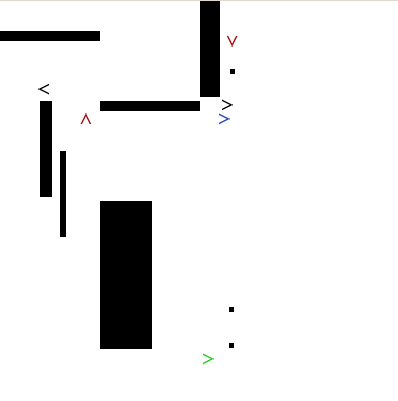

# AI Combat #

We are the AI@UCLA Gaming Group.

AI Combat is a top-down shooter in which programmable AI bots battle each other
in a closed arena. We're doing this in Python using the PyGame library to write
the engine and game logic.

**Goals**

- To become familiar with Python and the PyGame API
- Dive into game development
- Apply AI concepts to game dev
- Gain knowledge of general software development tools

# Development #

Our project is still in its very early stages! Stay tuned for more progress
over the upcoming months.

As of current, a basic game engine is in place and several primitive bots have
been implemented. These include a playerbot that the user can control, and an
aggressive stalkerbot that chase other bots to attack them.

The sprite textures are still placeholders at the moment, until we can find
proper images to use.

# Running #

To run AI Combat, simply execute:

    python AICombat/AICombat.py

# Dependencies #

AI Combat uses Python 2.7 and relies on the pygame library for windowing and
painting.

Find pygame in their download page at http://www.pygame.org/download.shtml
